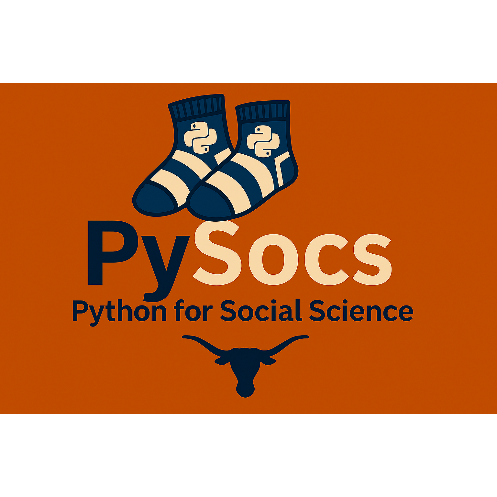

# PySocs: Python for Social Science

## Course Description

**Python for Social Science** is a hands-on course designed to introduce students to the use of Python programming in social science research. Topics include data processing, analysis, visualization, and modeling using Python tools and extended libraries. The course emphasizes practical applications and reproducible workflows for social scientists. 

## Materials

Scores of materials were borrowed from various sources and adapted, especially the following:

- McKinney, W. (2022). Python for data analysis: Data wrangling with pandas, NumPy, and IPython (3rd ed.). O'Reilly Media. https://wesmckinney.com/book/
- VanderPlas, J. (2022). Python data science handbook: Essential tools for working with data (2nd ed.). O'Reilly Media. https://jakevdp.github.io/PythonDataScienceHandbook/ 
- James, G., Witten, D., Hastie, T., Tibshirani, R., & Taylor, J. (2023). An introduction to statistical learning. Springer. https://www.statlearning.com/

## Assets

- [Full-size Banner](PySocs_banner.png)
- [Full-size Square Banner](PySocs_square_banner.png)
