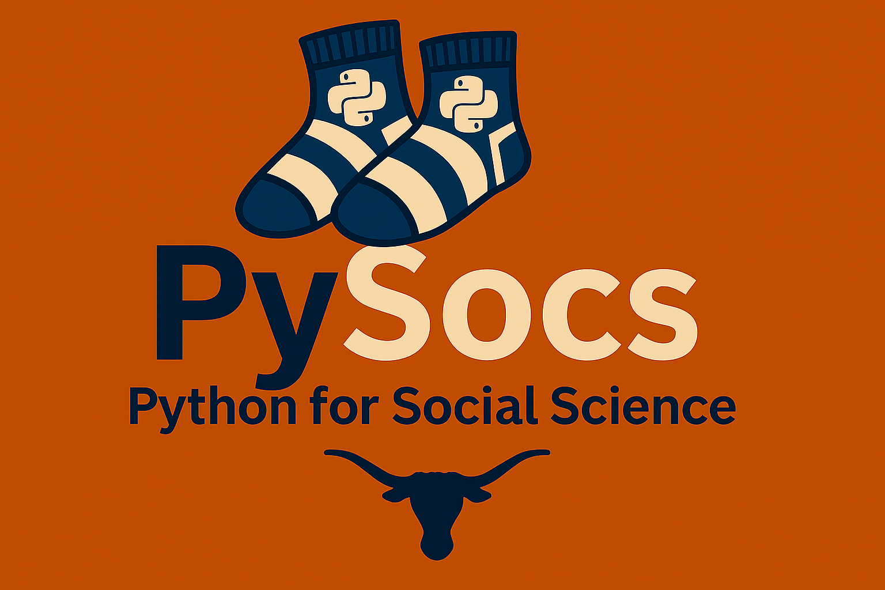
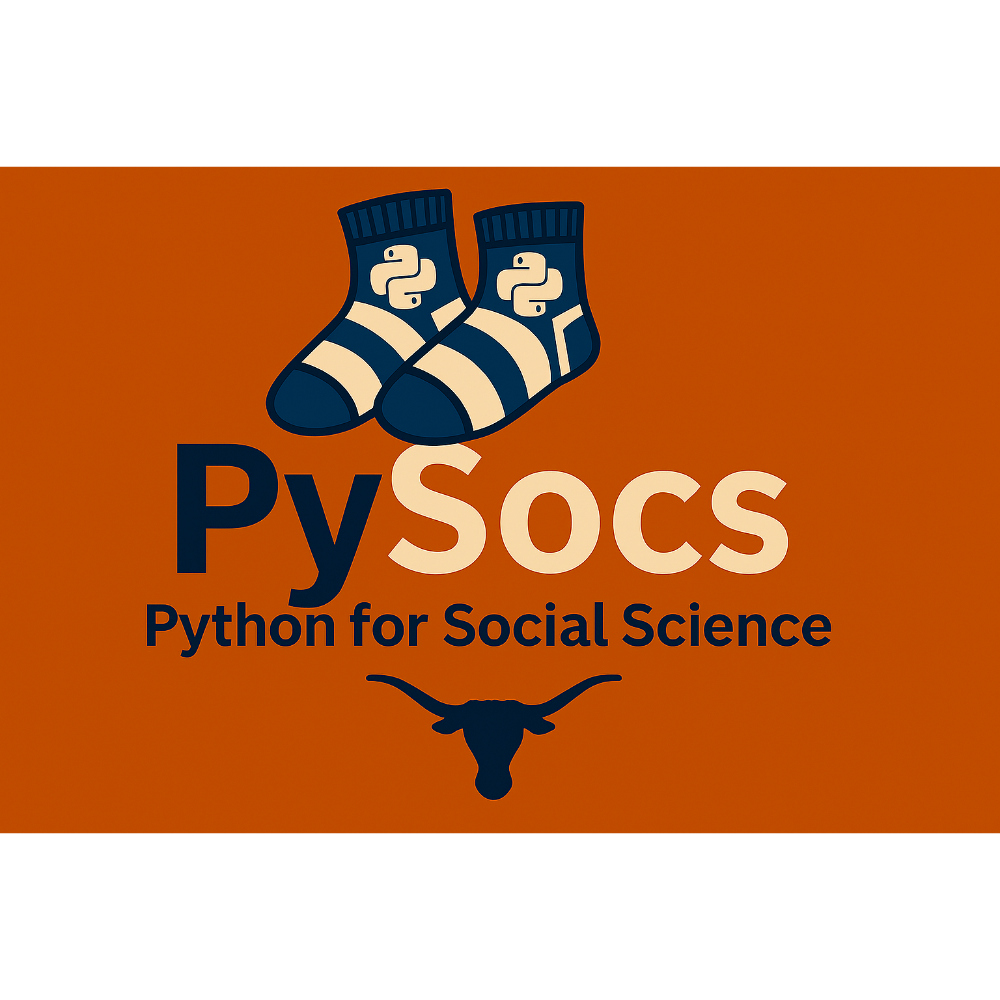

# PySocs

## Course Description

**Python for Social Science** is a hands-on course designed to introduce students to the use of Python programming in social science research. Topics include data collection, analysis, visualization, and modeling using Python tools and libraries. The course emphasizes practical applications and reproducible workflows for social scientists.

## Assets

- [Full-size Banner](PySocs_banner.png)
- [Full-size Square Banner](PySocs_square_banner.png)
